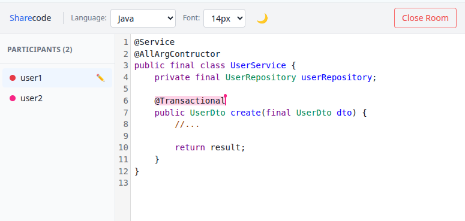

# Sharecode

A real-time collaborative code editor. Create a room, share the URL, and edit code together with live cursor and selection sync. Rooms auto-delete 5 minutes after the last participant disconnects.



## Features

- Real-time collaborative editing via Yjs CRDT
- Live cursor and selection awareness per participant
- Shared language selection across all participants
- Rooms expire automatically 5 minutes after everyone leaves
- Rate-limited room creation (10 rooms per IP)

## Tech stack

- **Backend:** Go (stdlib `net/http`, `gorilla/websocket`)
- **Frontend:** React + TypeScript, CodeMirror 6, Yjs, Vite, Tailwind CSS

## Building and running

### Docker (recommended)

```sh
docker compose up --build      # debug image (all logs enabled)
```

The app will be available at [http://localhost:8080](http://localhost:8080).

#### Docker build variants

```sh
make docker-build        # prod image  → sharecode:prod  (minimal logs)
make docker-build-debug  # debug image → sharecode:debug (all logs)
```

### Local development

**Prerequisites:** Go 1.22+, Node.js

**Backend:**

```sh
go run ./cmd/server          # prod (minimal logs)
DEBUG=1 go run ./cmd/server  # debug (all logs)
```

The server listens on `:8080` and serves the built frontend from `frontend/dist`.

**Frontend (in a separate terminal):**

```sh
cd frontend
npm install
npm run dev   # dev server on :5173, debug logs enabled
```

The Vite dev server runs on `:5173` and proxies `/api` and `/ws` requests to `:8080`. Open [http://localhost:5173](http://localhost:5173) for development with hot reload.

**Build variants:**

```sh
# prod (minimal logs)
cd frontend && npm run build
go run ./cmd/server

# debug (all logs)
cd frontend && npm run build:debug
DEBUG=1 go run ./cmd/server
```

Or via Makefile:

```sh
make run         # prod build + run
make run-debug   # debug build + run
```

## Running tests

```sh
go test ./...
```
